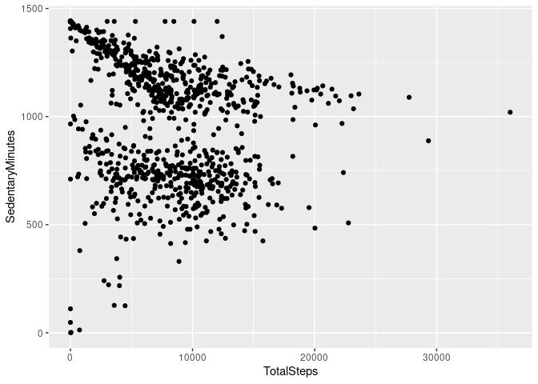

Fitness_data_analytics
================
2023-03-18

# これは何か？

この記事は、Rを用いたデータ分析プロセスの練習用として作成されたものである。
実行した分析のプロセスはごく簡単なものにとどまる。

# 概要

## ケーススタディ

スマートデバイスのフィットネスデータを分析して、
ウェルネス製品メーカー(B社)の広告戦略へのインサイトを提供するというケーススタディ。

## 分析

分析のプロセスは、準備、処理、分析、共有、行動という順で行った。

## 発見したこと

ユーザーの31日分の行動データを分析したところ、
椅子に座っている時間が長い人は、一日の歩行数が少ない傾向にあることが分かった。

## B社に対するインサイトの提供

椅子に座っている時間が長いことは、健康へのリスクがあることが知られている。
リスクの代表的なものとしては、エコノミー症候群である。
椅子に座っている時間が長い職についている人は、
この健康リスクを回避したいというニーズを潜在的に持っていると考える。

データ分析により、椅子に座っている時間が長い人は歩行量が少ない傾向にあると分かった。

B社の広告戦略としては、自社のスマートデバイスを用いることで、
**椅子に長時間座り続けていることを避けることができ、健康リスクを回避できる**
、ことを強調してユーザーに提示することが有用であると判断する。

また、椅子に座っている時間が長いことがリスクであるという知識が無い人へも、
新しく知識を提供するということを通じて、自社のスマートデバイスへの興味を持つ導線として活用できるだろう。

# データ分析の詳細

## データの準備

分析するデータを明確にする。

今回はフィットネスデータのオープンデータを活用する。
[Mobius](https://www.kaggle.com/arashnic)社が公開している[FitBit Fitness
Tracker
Data](https://www.kaggle.com/datasets/arashnic/fitbit)を利用する。

このデータセットは、B社のスマートデバイスで計測したデータではない。
しかし、データに含まれるユーザー数と、データ量、品質は十分あることを確認した。
そのため、このデータを分析することで、
B社のスマートデバイスに活用できるインサイトを十分得ることができると判断した。

## データの処理

データセットに含まれる、
ユーザーの日毎の活動データ(dailyActivity_marged.csv)を分析対象とする。

これにユーザーの様々な活動データが含まれているため、分析に適している。
分析の前に、データの検証を行う。

### 欠損の検証

データに欠損がないかを確認する。

``` r
daily_activity %>% 
  skim_without_charts()
```

|                                                  |            |
|:-------------------------------------------------|:-----------|
| Name                                             | Piped data |
| Number of rows                                   | 940        |
| Number of columns                                | 15         |
| \_\_\_\_\_\_\_\_\_\_\_\_\_\_\_\_\_\_\_\_\_\_\_   |            |
| Column type frequency:                           |            |
| character                                        | 1          |
| numeric                                          | 14         |
| \_\_\_\_\_\_\_\_\_\_\_\_\_\_\_\_\_\_\_\_\_\_\_\_ |            |
| Group variables                                  | None       |

Data summary

**Variable type: character**

| skim_variable | n_missing | complete_rate | min | max | empty | n_unique | whitespace |
|:--------------|----------:|--------------:|----:|----:|------:|---------:|-----------:|
| ActivityDate  |         0 |             1 |   8 |   9 |     0 |       31 |          0 |

**Variable type: numeric**

| skim_variable            | n_missing | complete_rate |         mean |           sd |         p0 |          p25 |          p50 |          p75 |         p100 |
|:-------------------------|----------:|--------------:|-------------:|-------------:|-----------:|-------------:|-------------:|-------------:|-------------:|
| Id                       |         0 |             1 | 4.855407e+09 | 2.424805e+09 | 1503960366 | 2.320127e+09 | 4.445115e+09 | 6.962181e+09 | 8.877689e+09 |
| TotalSteps               |         0 |             1 | 7.637910e+03 | 5.087150e+03 |          0 | 3.789750e+03 | 7.405500e+03 | 1.072700e+04 | 3.601900e+04 |
| TotalDistance            |         0 |             1 | 5.490000e+00 | 3.920000e+00 |          0 | 2.620000e+00 | 5.240000e+00 | 7.710000e+00 | 2.803000e+01 |
| TrackerDistance          |         0 |             1 | 5.480000e+00 | 3.910000e+00 |          0 | 2.620000e+00 | 5.240000e+00 | 7.710000e+00 | 2.803000e+01 |
| LoggedActivitiesDistance |         0 |             1 | 1.100000e-01 | 6.200000e-01 |          0 | 0.000000e+00 | 0.000000e+00 | 0.000000e+00 | 4.940000e+00 |
| VeryActiveDistance       |         0 |             1 | 1.500000e+00 | 2.660000e+00 |          0 | 0.000000e+00 | 2.100000e-01 | 2.050000e+00 | 2.192000e+01 |
| ModeratelyActiveDistance |         0 |             1 | 5.700000e-01 | 8.800000e-01 |          0 | 0.000000e+00 | 2.400000e-01 | 8.000000e-01 | 6.480000e+00 |
| LightActiveDistance      |         0 |             1 | 3.340000e+00 | 2.040000e+00 |          0 | 1.950000e+00 | 3.360000e+00 | 4.780000e+00 | 1.071000e+01 |
| SedentaryActiveDistance  |         0 |             1 | 0.000000e+00 | 1.000000e-02 |          0 | 0.000000e+00 | 0.000000e+00 | 0.000000e+00 | 1.100000e-01 |
| VeryActiveMinutes        |         0 |             1 | 2.116000e+01 | 3.284000e+01 |          0 | 0.000000e+00 | 4.000000e+00 | 3.200000e+01 | 2.100000e+02 |
| FairlyActiveMinutes      |         0 |             1 | 1.356000e+01 | 1.999000e+01 |          0 | 0.000000e+00 | 6.000000e+00 | 1.900000e+01 | 1.430000e+02 |
| LightlyActiveMinutes     |         0 |             1 | 1.928100e+02 | 1.091700e+02 |          0 | 1.270000e+02 | 1.990000e+02 | 2.640000e+02 | 5.180000e+02 |
| SedentaryMinutes         |         0 |             1 | 9.912100e+02 | 3.012700e+02 |          0 | 7.297500e+02 | 1.057500e+03 | 1.229500e+03 | 1.440000e+03 |
| Calories                 |         0 |             1 | 2.303610e+03 | 7.181700e+02 |          0 | 1.828500e+03 | 2.134000e+03 | 2.793250e+03 | 4.900000e+03 |

データに欠損が無いことを確認した。

### ユーザーデータ数の検証

データ入手元には、30人分のユーザーデータが含まれているという記述がある。
実際のデータに30人分のデータが含まれているか検証する。

``` r
n_distinct(daily_activity$Id)
```

    ## [1] 33

30人分以上のデータが含まれているため、問題ないと判断する。

### 各ユーザーのデータ量の検証

各ユーザーがどのぐらいのデータが登録されているかを確認する。
データ取得期間は03.12.2016-05.12.2016.までの記録である。
完全にデータがある場合、各ユーザーは31日分のデータが存在する。

``` r
daily_activity %>%
   select(Id) %>% 
   table()
```

    ## Id
    ## 1503960366 1624580081 1644430081 1844505072 1927972279 2022484408 2026352035 
    ##         31         31         30         31         31         31         31 
    ## 2320127002 2347167796 2873212765 3372868164 3977333714 4020332650 4057192912 
    ##         31         18         31         20         30         31          4 
    ## 4319703577 4388161847 4445114986 4558609924 4702921684 5553957443 5577150313 
    ##         31         31         31         31         31         31         30 
    ## 6117666160 6290855005 6775888955 6962181067 7007744171 7086361926 8053475328 
    ##         28         29         26         31         26         31         31 
    ## 8253242879 8378563200 8583815059 8792009665 8877689391 
    ##         19         31         31         29         31

極端にデータが少ないユーザーが1件である。
完全なデータではないユーザーは11件である。
完全なデータのユーザーは21件である。

今回はすべてのデータを分析に活用する。

### データ分析

1 日の歩数と座っている時間の関係をプロットする。

``` r
ggplot(data=daily_activity, aes(x=TotalSteps, y=SedentaryMinutes)) + geom_point()
```

<!-- -->

プロットの図より、座っている時間が長い人は一日の歩行数が少ない傾向にあることが分かった。

## 共有

B社のステークホルダーはある程度数字に強いため、
プレゼンテーションでは散布図グラフをで提示しても問題ないと判断する。

プレゼンテーション資料については割愛する。

## 行動

### インサイトの共有

B社に対してのインサイトの報告は以下を行う。

椅子に座っている時間が長いことは、健康へのリスクがあることが知られている。
リスクの代表的なものとしては、エコノミー症候群である。
椅子に座っている時間が長い職についている人は、
この健康リスクを回避したいというニーズを潜在的に持っていると考える。

データ分析により、椅子に座っている時間が長い人は歩行量が少ない傾向にあると分かった。

B社の広告戦略としては、自社のスマートデバイスを用いることで、
**椅子に長時間座り続けていることを避けることができ、健康リスクを回避できる**
、ことを強調してユーザーに提示することが有用であると判断する。

また、椅子に座っている時間が長いことがリスクであるという知識が無い人へも、
新しく知識を提供するということを通じて、自社のスマートデバイスへの興味を持つ導線として活用できるだろう。

### さらなる調査

さらなる分析として、以下のような調査を行うことでも興味深い結果が得られると考えられる。

- 長時間座り続けている場合の睡眠時間への影響
- 体重計測データの計測量がほかデータに比べて極端に少ないことの調査
